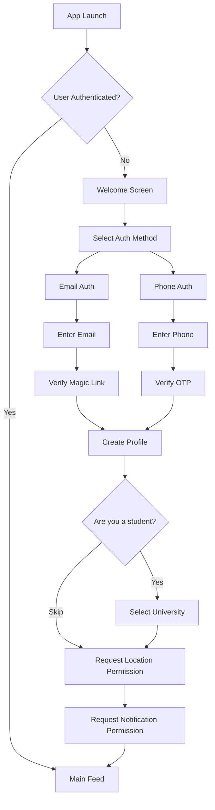
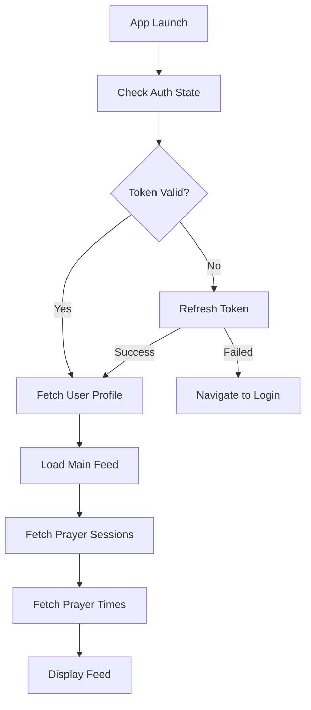
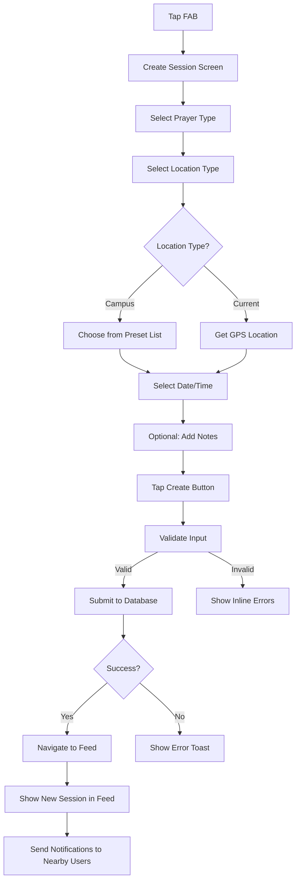

# App Flow Documentation

**Last Updated**: January 29, 2026  
**Version**: 1.0

## Overview

This document outlines all user flows and screen transitions in the Jamaat app. Use this as a reference when implementing navigation, state management, and user experience features.

---

## Navigation Structure

```
App Root
├── (auth) - Unauthenticated flow
│   ├── welcome - Entry point
│   ├── login - Email/Phone authentication
│   └── student-verification - Optional .edu verification
│
└── (tabs) - Authenticated flow
    ├── index (Feed) - Main screen
    ├── create - Create prayer session
    └── settings - User settings
```

---

## 1. First-Time User Flow

### 1.1 Onboarding Journey



### 1.2 Screen-by-Screen Breakdown

#### Screen 1: Welcome
- **Purpose**: First impression, value proposition
- **Elements**: Logo, tagline, "Get Started" CTA
- **Actions**: 
  - Tap "Get Started" → Navigate to Login
- **State**: No authentication required

#### Screen 2: Login
- **Purpose**: Choose authentication method
- **Elements**: 
  - "Continue with Email" button
  - "Continue with Phone" button
- **Actions**:
  - Tap Email → Show email input
  - Tap Phone → Show phone input
- **State**: Trigger Supabase auth flow

#### Screen 3: Email/Phone Input
- **Purpose**: Collect authentication credentials
- **Elements**:
  - Input field (email or phone with country code)
  - "Continue" button
  - "Terms & Privacy" links
- **Actions**:
  - Submit → Send magic link/OTP
  - Show loading state
  - On success → Navigate to verification
- **Validation**:
  - Email: Valid format (RFC 5322)
  - Phone: Valid E.164 format (+1234567890)
- **Errors**: "Invalid email" / "Invalid phone number"

#### Screen 4: Verification
- **Purpose**: Verify ownership of email/phone
- **Elements**:
  - For email: "Check your inbox" message
  - For phone: 6-digit OTP input
  - "Resend code" link (disabled for 60s)
- **Actions**:
  - Email: Opens email app (deep link)
  - Phone: Auto-submit on 6 digits entered
  - On success → Navigate to profile creation
- **Errors**: "Invalid code" / "Code expired"

#### Screen 5: Create Profile
- **Purpose**: Set display name
- **Elements**:
  - Display name input (max 50 chars)
  - "Continue" button
- **Actions**:
  - Submit → Create user record in database
  - On success → Navigate to student opt-in
- **Validation**: Name required, 2-50 chars
- **Default**: Pre-fill with name from email (if available)

#### Screen 6: Student Opt-in
- **Purpose**: Identify students for campus features
- **Elements**:
  - "Are you a student?" heading
  - "Yes" button (primary)
  - "Skip for now" button (secondary)
- **Actions**:
  - Yes → Navigate to university selection
  - Skip → Navigate to permissions
- **State**: Update `is_student` in database

#### Screen 7: University Selection
- **Purpose**: Link user to campus
- **Elements**:
  - Search input (autocomplete)
  - List of universities (alphabetical)
  - "Can't find your school?" link
- **Actions**:
  - Select university → Update `university_id`
  - Navigate to permissions
- **Future**: Add "Request new university" form

#### Screen 8: Location Permission
- **Purpose**: Enable location-based features
- **Elements**:
  - Icon/illustration
  - Explanation text
  - "Allow Location" button
  - "Not now" button
- **Actions**:
  - Allow → Request iOS/Android permission
  - On grant → Navigate to notifications
  - On deny → Still navigate (show limitation later)
- **Note**: Required for "current location" feature

#### Screen 9: Notification Permission
- **Purpose**: Enable push notifications
- **Elements**:
  - Icon/illustration
  - Explanation text
  - "Enable Notifications" button
  - "Maybe later" button
- **Actions**:
  - Enable → Request iOS/Android permission
  - On grant → Save Expo push token
  - Navigate to main feed
- **Note**: Can be re-enabled in settings

---

## 2. Returning User Flow

### 2.1 App Launch (Authenticated)



### 2.2 Normal Usage Pattern

**Step 1**: Open app → See feed  
**Step 2**: Browse upcoming prayers  
**Step 3**: Join prayer (1 tap)  
**Step 4**: Receive reminder notification (15 min before)  
**Step 5**: Attend prayer in-person  
**Step 6**: (Future) App asks "Did you attend?"

---

## 3. Main Feed Flow

### 3.1 Feed Screen Components

```
┌─────────────────────────────────┐
│ Header (fixed)                  │
│  - Logo                         │
│  - Location selector            │
│  - Settings icon                │
├─────────────────────────────────┤
│ Prayer Times (sticky)           │
│  - Today's 5 prayer times       │
│  - Highlight current prayer     │
├─────────────────────────────────┤
│ Feed (scrollable)               │
│  - Upcoming prayers list        │
│  - Session cards                │
│  - Load more (infinite scroll)  │
├─────────────────────────────────┤
│ FAB (floating)                  │
│  - Create prayer button         │
└─────────────────────────────────┘
```

### 3.2 Feed Interactions

#### Pull to Refresh
- **Trigger**: Pull down on feed
- **Action**: 
  - Refetch prayer sessions
  - Refetch prayer times (if expired)
  - Show loading indicator
- **State**: Optimistic update (show cached data first)

#### Tap Session Card
- **Trigger**: Tap anywhere on card (except Join button)
- **Action**: Navigate to session detail screen (future)
- **State**: Pass session ID as param

#### Tap Join Button
- **Trigger**: Tap "Join" button
- **Action**:
  1. Optimistic update: Change to "Joined ✓", increment count
  2. Insert record in `session_attendees` table
  3. On success: Keep optimistic state
  4. On error: Rollback optimistic update, show error toast
- **State**: Disable button during API call

#### Tap Joined Button
- **Trigger**: Tap "Joined ✓" button (leave)
- **Action**:
  1. Show confirmation: "Leave this prayer?"
  2. If confirmed: Delete from `session_attendees`
  3. Update UI: Change to "Join", decrement count
- **State**: Same optimistic update pattern

#### Tap FAB
- **Trigger**: Tap "+" button
- **Action**: Navigate to create session screen
- **Animation**: FAB rotates 45° (+ becomes ×)

#### Scroll to Load More
- **Trigger**: Scroll near bottom (threshold: 200px from end)
- **Action**: 
  - Fetch next 20 sessions
  - Append to feed
  - Show loading indicator at bottom
- **State**: Track `page` and `hasMore` flags

---

## 4. Create Prayer Session Flow

### 4.1 Screen Progression



### 4.2 Form Fields & Validation

#### Prayer Type (Required)
- **Type**: Button group (single select)
- **Options**: Fajr, Dhuhr, Asr, Maghrib, Isha, Jummah
- **Default**: Pre-select next upcoming prayer
- **Validation**: Must select one

#### Location Type (Required)
- **Type**: Radio buttons
- **Options**:
  1. Campus Prayer Space (dropdown)
  2. My Current Location (GPS)
- **Default**: Campus (if student), Current (if not)
- **Validation**: Must select one and complete sub-selection

#### Campus Prayer Space (Conditional)
- **Type**: Dropdown/modal picker
- **Options**: Query `prayer_spaces` where `university_id = user.university_id` and `is_verified = true`
- **Display**: Space name (e.g., "Maloney 4th Floor")
- **Future**: Add "+ Create new space" option

#### Current Location (Conditional)
- **Type**: Auto-populated from GPS
- **Display**: "Using your location" with lat/lng
- **Optional**: Text input for custom name
- **Validation**: Location permission required

#### Date (Required)
- **Type**: Date picker (iOS/Android native)
- **Default**: Today
- **Range**: Today to +7 days
- **Validation**: Cannot select past date

#### Time (Required)
- **Type**: Time picker (iOS/Android native)
- **Default**: Next prayer time (from Aladhan API)
- **Validation**: Must be in future (compare with current time)

#### Notes (Optional)
- **Type**: Multiline text input
- **Max length**: 500 characters
- **Placeholder**: "e.g., Bring prayer rug"
- **Display**: Character counter (shows when >400 chars)

### 4.3 Submission Logic

```typescript
const handleSubmit = async () => {
  // 1. Validate all fields
  const validation = createSessionSchema.safeParse(formData);
  if (!validation.success) {
    showInlineErrors(validation.error);
    return;
  }

  // 2. Show loading state
  setIsSubmitting(true);

  try {
    // 3. Insert into database
    const { data, error } = await supabase
      .from('prayer_sessions')
      .insert({
        prayer_type: formData.prayerType,
        prayer_space_id: formData.locationType === 'campus' ? formData.spaceId : null,
        custom_location: formData.locationType === 'current' ? formData.location : null,
        custom_location_name: formData.customLocationName,
        scheduled_time: formData.dateTime.toISOString(),
        notes: formData.notes,
        created_by: user.id,
      })
      .select()
      .single();

    if (error) throw error;

    // 4. Navigate back to feed
    router.push('/(tabs)');

    // 5. Show success toast
    showToast('Prayer session created!');

    // 6. Trigger notifications (handled by Supabase function)
  } catch (error) {
    // 7. Handle errors
    showToast('Failed to create session. Try again.');
    console.error(error);
  } finally {
    setIsSubmitting(false);
  }
};
```

---

## 5. Settings Flow

### 5.1 Settings Screen Structure

```
Settings
├── Profile
│   ├── Display Name (editable)
│   ├── Email (read-only, verified badge)
│   └── Phone (read-only, if used)
├── Student Status
│   ├── University (changeable)
│   └── Verify .edu Email (if not verified)
├── Notifications
│   ├── New prayers near me (toggle)
│   ├── Someone joins my prayer (toggle)
│   └── Daily prayer reminders (toggle)
├── Location
│   ├── Default view (Campus / Radius)
│   └── Radius (2 mi / 5 mi / 10 mi)
├── About
│   ├── Version number
│   ├── Privacy Policy (external link)
│   ├── Terms of Service (external link)
│   └── Contact Support (email link)
└── Account
    ├── Log Out
    └── Delete Account (future)
```

### 5.2 Key Actions

#### Change Display Name
1. Tap on name field
2. Show modal with text input
3. Save → Update `users` table
4. Show toast: "Name updated"

#### Change University
1. Tap "Change" button
2. Navigate to university selection (same as onboarding)
3. Update `university_id`
4. Refetch feed (new prayer spaces)

#### Toggle Notifications
1. Tap toggle switch
2. Update `notification_preferences` JSONB in database
3. If disabling all: Warn "You won't receive prayer updates"

#### Log Out
1. Tap "Log Out"
2. Show confirmation: "Are you sure?"
3. If confirmed:
   - Clear Supabase session
   - Clear local storage (SecureStore)
   - Navigate to welcome screen

---

## 6. Notification Flows

### 6.1 Notification Types

#### Type 1: New Prayer Near You
- **Trigger**: Session created within user's radius (2 mi default)
- **Title**: "New prayer session near you"
- **Body**: "Dhuhr at 12:30 PM in Maloney 4th Floor (0.3 mi away)"
- **Data**: `{ type: 'new_prayer', sessionId: '...' }`
- **Action**: Tap → Open app to that session

#### Type 2: Someone Joined Your Prayer
- **Trigger**: User joins a session you created
- **Title**: "Someone joined your prayer"
- **Body**: "3 people are now attending your Asr prayer at 3:30 PM"
- **Data**: `{ type: 'prayer_joined', sessionId: '...' }`
- **Action**: Tap → Open app to that session

#### Type 3: Prayer Reminder (Future)
- **Trigger**: 15 minutes before scheduled time
- **Title**: "Prayer reminder"
- **Body**: "Dhuhr prayer starts in 15 minutes at Maloney 4th Floor"
- **Data**: `{ type: 'reminder', sessionId: '...' }`
- **Action**: Tap → Open app to that session

### 6.2 Notification Handling

```typescript
// When app is in foreground
Notifications.addNotificationReceivedListener(notification => {
  // Show in-app banner (toast or modal)
  showInAppNotification(notification);
});

// When user taps notification (app closed or background)
Notifications.addNotificationResponseReceivedListener(response => {
  const { sessionId } = response.notification.request.content.data;
  
  // Navigate to session detail (or feed)
  router.push(`/(tabs)?sessionId=${sessionId}`);
});
```

---

## 7. Real-Time Updates

### 7.1 Supabase Realtime Subscriptions

#### Feed Screen
Subscribe to new sessions and attendee changes:

```typescript
useEffect(() => {
  // Subscribe to new sessions
  const sessionSubscription = supabase
    .channel('prayer_sessions')
    .on('postgres_changes', {
      event: 'INSERT',
      schema: 'public',
      table: 'prayer_sessions',
      filter: `is_active=eq.true`,
    }, payload => {
      // Check if session is within user's radius
      if (isWithinRadius(payload.new)) {
        addSessionToFeed(payload.new);
      }
    })
    .subscribe();

  // Subscribe to attendee changes
  const attendeeSubscription = supabase
    .channel('session_attendees')
    .on('postgres_changes', {
      event: '*',
      schema: 'public',
      table: 'session_attendees',
    }, payload => {
      updateAttendeeCount(payload);
    })
    .subscribe();

  return () => {
    sessionSubscription.unsubscribe();
    attendeeSubscription.unsubscribe();
  };
}, []);
```

#### Session Detail Screen (Future)
Subscribe to specific session updates:

```typescript
const sessionId = route.params.sessionId;

const subscription = supabase
  .channel(`session:${sessionId}`)
  .on('postgres_changes', {
    event: '*',
    schema: 'public',
    table: 'session_attendees',
    filter: `session_id=eq.${sessionId}`,
  }, payload => {
    refetchAttendees();
  })
  .subscribe();
```

---

## 8. Error States & Empty States

### 8.1 Empty States

#### Feed: No Sessions
- **Icon**: 🕌 (mosque illustration)
- **Heading**: "No prayers scheduled yet"
- **Body**: "Be the first to create a prayer session"
- **CTA**: "Create Prayer" button → Navigate to create screen

#### Feed: No Sessions Near You
- **Icon**: 📍 (location pin)
- **Heading**: "No prayers nearby"
- **Body**: "Try expanding your search radius or create a prayer"
- **CTA**: "Expand Radius" → Open settings

#### Settings: Not a Student
- **State**: University section shows "Not a student"
- **CTA**: "I'm a student" → Trigger university selection

### 8.2 Error States

#### Network Error
- **Display**: Red banner at top of screen
- **Message**: "You're offline. Changes will sync when reconnected."
- **Dismissible**: Auto-hide when connection restored

#### Location Permission Denied
- **Display**: Modal on create screen
- **Message**: "Location access is required to use 'current location'"
- **CTA**: "Open Settings" → Deep link to app settings

#### Session Creation Failed
- **Display**: Toast message
- **Message**: "Failed to create session. Try again."
- **Action**: Keep form filled (don't reset)

#### Prayer Times API Failed
- **Display**: Skeleton UI with warning icon
- **Message**: "Prayer times unavailable"
- **Fallback**: Use cached times from previous day

---

## 9. Navigation Patterns

### 9.1 Navigation Methods

#### Stack Navigation
- Used for: Auth flow (welcome → login → profile)
- Pattern: Push/pop
- Gesture: Swipe back (iOS), back button (Android)

#### Tab Navigation
- Used for: Main app (feed, create, settings)
- Pattern: Switch between tabs
- Gesture: Tap tab bar icons

#### Modal Navigation
- Used for: Create session (future: can be modal instead of tab)
- Pattern: Present/dismiss
- Gesture: Swipe down to dismiss

### 9.2 Deep Linking

#### URL Scheme: `jamaat://`

**Examples**:
- `jamaat://session/123` → Open specific session
- `jamaat://create` → Open create screen
- `jamaat://settings` → Open settings
- `jamaat://verify?token=xyz` → Email verification

**Implementation** (Expo Router):
```typescript
// app/_layout.tsx
<Stack screenOptions={{ headerShown: false }}>
  <Stack.Screen name="(auth)" />
  <Stack.Screen name="(tabs)" />
  <Stack.Screen name="session/[id]" />
</Stack>
```

---

## 10. State Management

### 10.1 Global State (Zustand)

#### Auth Store
```typescript
{
  user: User | null,
  session: Session | null,
  isLoading: boolean,
  signIn: (email: string) => Promise<void>,
  signOut: () => Promise<void>,
}
```

#### Session Store
```typescript
{
  sessions: PrayerSession[],
  isLoading: boolean,
  hasMore: boolean,
  fetchSessions: () => Promise<void>,
  createSession: (data: SessionInput) => Promise<void>,
  joinSession: (sessionId: string) => Promise<void>,
}
```

#### Prayer Times Store
```typescript
{
  times: PrayerTimes | null,
  lastFetched: Date | null,
  isLoading: boolean,
  fetchTimes: (lat: number, lng: number) => Promise<void>,
}
```

### 10.2 Local State (React State)

Use for:
- Form inputs (create session)
- UI states (modal open/closed)
- Temporary data (search query)

### 10.3 Server State (Supabase Realtime)

Use for:
- Prayer sessions feed
- Attendee counts
- New session notifications

---

## 11. Offline Behavior

### 11.1 Offline First Strategy

#### Cached Data
- Prayer times (24 hour expiry)
- User profile
- University list
- Last viewed feed (10 most recent sessions)

#### Queue Operations
- Create session → Queue, sync when online
- Join session → Queue, sync when online
- Leave session → Queue, sync when online

#### Conflict Resolution
- Last write wins (Supabase handles this)
- Show warning if stale data: "This session may have changed"

### 11.2 Offline UI

```typescript
import NetInfo from '@react-native-community/netinfo';

const [isOffline, setIsOffline] = useState(false);

useEffect(() => {
  const unsubscribe = NetInfo.addEventListener(state => {
    setIsOffline(!state.isConnected);
  });

  return () => unsubscribe();
}, []);

// Show offline banner
{isOffline && (
  <Banner type="warning">
    You're offline. Changes will sync when reconnected.
  </Banner>
)}
```

---

## 12. Analytics Events

### 12.1 Track These Events

| Event | Properties | When |
|-------|-----------|------|
| `user_signed_up` | `method: 'email' \| 'phone'` | After successful sign-up |
| `session_created` | `prayer_type`, `location_type` | After creating prayer |
| `session_joined` | `session_id`, `attendee_count` | After joining prayer |
| `session_left` | `session_id` | After leaving prayer |
| `notification_received` | `type`, `session_id` | When notification arrives |
| `notification_tapped` | `type`, `session_id` | When user taps notification |
| `feed_refreshed` | | Pull to refresh |
| `prayer_times_viewed` | | Prayer times expanded |

### 12.2 Implementation

```typescript
import * as Analytics from 'expo-firebase-analytics';

// Example
await Analytics.logEvent('session_created', {
  prayer_type: 'dhuhr',
  location_type: 'campus',
});
```

---

## Version History

| Version | Date | Changes |
|---------|------|---------|
| 1.0 | Jan 29, 2026 | Initial document |

---

**Next Review**: After MVP launch (estimate: March 2026)
