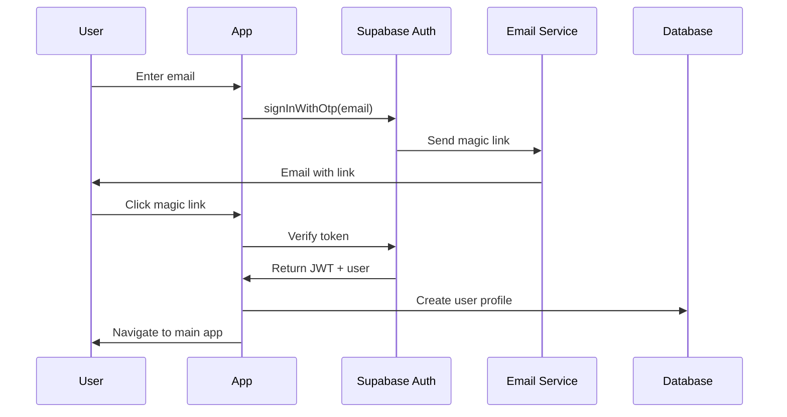
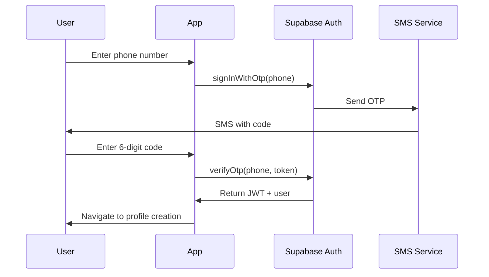

# Database & Authentication Documentation

**Last Updated**: January 29, 2026  
**Version**: 1.0

## Overview

This document provides a comprehensive guide to the database schema, authentication system, Row Level Security (RLS) policies, and data access patterns for Jamaat.

---

## 1. Database Overview

### 1.1 Technology Stack

- **Database**: PostgreSQL 15.x
- **Extensions**: PostGIS (geospatial queries), pgcrypto (UUID generation)
- **Hosting**: Supabase (managed PostgreSQL)
- **Migrations**: Supabase migrations (SQL files)

### 1.2 Key Features

- **Geospatial support**: PostGIS for radius-based queries
- **Row Level Security**: Automatic authorization at database level
- **Real-time subscriptions**: Live updates via Supabase Realtime
- **ACID compliance**: Full transaction support
- **Automatic backups**: Daily snapshots with 7-day retention

---

## 2. Complete Schema

### 2.1 Users Table

```sql
-- Extends Supabase auth.users
CREATE TABLE public.users (
  id UUID PRIMARY KEY REFERENCES auth.users(id) ON DELETE CASCADE,
  email TEXT,
  phone TEXT,
  display_name TEXT NOT NULL,
  is_student BOOLEAN DEFAULT false,
  university_id UUID REFERENCES universities(id) ON DELETE SET NULL,
  expo_push_token TEXT,
  notification_preferences JSONB DEFAULT '{
    "new_prayers": true,
    "prayer_joined": true,
    "daily_reminders": false
  }'::jsonb,
  created_at TIMESTAMPTZ DEFAULT NOW(),
  updated_at TIMESTAMPTZ DEFAULT NOW(),
  CONSTRAINT valid_display_name CHECK (char_length(display_name) BETWEEN 2 AND 50)
);

-- Indexes
CREATE INDEX idx_users_university ON users(university_id);
CREATE INDEX idx_users_expo_token ON users(expo_push_token) WHERE expo_push_token IS NOT NULL;
CREATE INDEX idx_users_email ON users(email) WHERE email IS NOT NULL;

-- Comments
COMMENT ON TABLE users IS 'User profiles extending Supabase auth.users';
COMMENT ON COLUMN users.expo_push_token IS 'Expo push notification token';
COMMENT ON COLUMN users.notification_preferences IS 'JSONB object with notification settings';
```

### 2.2 Universities Table

```sql
CREATE TABLE public.universities (
  id UUID PRIMARY KEY DEFAULT gen_random_uuid(),
  name TEXT NOT NULL UNIQUE,
  location GEOGRAPHY(POINT, 4326),
  email_domain TEXT,
  city TEXT,
  state TEXT,
  country TEXT DEFAULT 'United States',
  is_active BOOLEAN DEFAULT true,
  created_at TIMESTAMPTZ DEFAULT NOW(),
  CONSTRAINT valid_email_domain CHECK (email_domain ~ '^@[a-zA-Z0-9.-]+\.[a-zA-Z]{2,}$')
);

-- Indexes
CREATE INDEX idx_universities_name ON universities(name);
CREATE INDEX idx_universities_location ON universities USING GIST(location);
CREATE INDEX idx_universities_active ON universities(is_active) WHERE is_active = true;

-- Full-text search index (future)
CREATE INDEX idx_universities_name_trgm ON universities USING gin(name gin_trgm_ops);

-- Comments
COMMENT ON TABLE universities IS 'List of supported universities/colleges';
COMMENT ON COLUMN universities.location IS 'Campus center coordinates (PostGIS POINT)';
COMMENT ON COLUMN universities.email_domain IS 'Email domain for student verification (e.g., @bc.edu)';
```

### 2.3 Prayer Spaces Table

```sql
CREATE TABLE public.prayer_spaces (
  id UUID PRIMARY KEY DEFAULT gen_random_uuid(),
  name TEXT NOT NULL,
  location GEOGRAPHY(POINT, 4326) NOT NULL,
  university_id UUID REFERENCES universities(id) ON DELETE CASCADE,
  space_type TEXT NOT NULL CHECK (space_type IN ('campus', 'masjid', 'community_center', 'custom')),
  description TEXT,
  created_by UUID REFERENCES users(id) ON DELETE SET NULL,
  is_verified BOOLEAN DEFAULT false,
  verification_status TEXT DEFAULT 'pending' CHECK (verification_status IN ('pending', 'approved', 'rejected')),
  verified_by UUID REFERENCES users(id) ON DELETE SET NULL,
  verified_at TIMESTAMPTZ,
  created_at TIMESTAMPTZ DEFAULT NOW(),
  updated_at TIMESTAMPTZ DEFAULT NOW(),
  CONSTRAINT valid_name CHECK (char_length(name) BETWEEN 3 AND 100),
  CONSTRAINT university_required_for_campus CHECK (
    (space_type = 'campus' AND university_id IS NOT NULL) OR
    (space_type != 'campus')
  )
);

-- Indexes
CREATE INDEX idx_prayer_spaces_university ON prayer_spaces(university_id);
CREATE INDEX idx_prayer_spaces_location ON prayer_spaces USING GIST(location);
CREATE INDEX idx_prayer_spaces_verified ON prayer_spaces(is_verified, space_type);
CREATE INDEX idx_prayer_spaces_creator ON prayer_spaces(created_by);

-- Comments
COMMENT ON TABLE prayer_spaces IS 'Physical locations where prayers can be held';
COMMENT ON COLUMN prayer_spaces.verification_status IS 'Approval status for user-submitted spaces';
```

### 2.4 Prayer Sessions Table

```sql
CREATE TABLE public.prayer_sessions (
  id UUID PRIMARY KEY DEFAULT gen_random_uuid(),
  prayer_space_id UUID REFERENCES prayer_spaces(id) ON DELETE CASCADE,
  custom_location GEOGRAPHY(POINT, 4326),
  custom_location_name TEXT,
  prayer_type TEXT NOT NULL CHECK (prayer_type IN ('fajr', 'dhuhr', 'asr', 'maghrib', 'isha', 'jummah')),
  scheduled_time TIMESTAMPTZ NOT NULL,
  notes TEXT,
  created_by UUID NOT NULL REFERENCES users(id) ON DELETE CASCADE,
  is_active BOOLEAN DEFAULT true,
  is_cancelled BOOLEAN DEFAULT false,
  created_at TIMESTAMPTZ DEFAULT NOW(),
  updated_at TIMESTAMPTZ DEFAULT NOW(),
  
  -- Constraints
  CONSTRAINT valid_location CHECK (
    (prayer_space_id IS NOT NULL AND custom_location IS NULL) OR
    (prayer_space_id IS NULL AND custom_location IS NOT NULL)
  ),
  CONSTRAINT future_scheduled_time CHECK (scheduled_time > created_at),
  CONSTRAINT valid_notes_length CHECK (char_length(notes) <= 500)
);

-- Indexes
CREATE INDEX idx_prayer_sessions_space ON prayer_sessions(prayer_space_id);
CREATE INDEX idx_prayer_sessions_time ON prayer_sessions(scheduled_time) WHERE is_active = true;
CREATE INDEX idx_prayer_sessions_creator ON prayer_sessions(created_by);
CREATE INDEX idx_prayer_sessions_prayer_type ON prayer_sessions(prayer_type);
CREATE INDEX idx_prayer_sessions_location ON prayer_sessions USING GIST(custom_location);
CREATE INDEX idx_prayer_sessions_active ON prayer_sessions(is_active, scheduled_time) WHERE is_active = true;

-- Comments
COMMENT ON TABLE prayer_sessions IS 'Scheduled prayer events';
COMMENT ON COLUMN prayer_sessions.custom_location IS 'GPS location if user selected "current location"';
COMMENT ON COLUMN prayer_sessions.is_active IS 'False after prayer time passes (auto-deactivated)';
```

### 2.5 Session Attendees Table

```sql
CREATE TABLE public.session_attendees (
  id UUID PRIMARY KEY DEFAULT gen_random_uuid(),
  session_id UUID NOT NULL REFERENCES prayer_sessions(id) ON DELETE CASCADE,
  user_id UUID NOT NULL REFERENCES users(id) ON DELETE CASCADE,
  joined_at TIMESTAMPTZ DEFAULT NOW(),
  UNIQUE(session_id, user_id)
);

-- Indexes
CREATE INDEX idx_session_attendees_session ON session_attendees(session_id);
CREATE INDEX idx_session_attendees_user ON session_attendees(user_id);

-- Comments
COMMENT ON TABLE session_attendees IS 'Many-to-many relationship between users and prayer sessions';
```

---

## 3. Database Functions

### 3.1 Get Sessions Within Radius

```sql
CREATE OR REPLACE FUNCTION get_sessions_within_radius(
  user_lat DOUBLE PRECISION,
  user_lng DOUBLE PRECISION,
  radius_meters INTEGER DEFAULT 3218,  -- 2 miles
  from_time TIMESTAMPTZ DEFAULT NOW(),
  limit_count INTEGER DEFAULT 50
)
RETURNS TABLE (
  session_id UUID,
  prayer_type TEXT,
  scheduled_time TIMESTAMPTZ,
  space_name TEXT,
  space_type TEXT,
  location_lat DOUBLE PRECISION,
  location_lng DOUBLE PRECISION,
  distance_meters DOUBLE PRECISION,
  attendee_count BIGINT,
  notes TEXT,
  created_by_id UUID,
  created_by_name TEXT,
  is_cancelled BOOLEAN
) 
LANGUAGE plpgsql
STABLE
AS $$
BEGIN
  RETURN QUERY
  SELECT 
    ps.id,
    ps.prayer_type,
    ps.scheduled_time,
    COALESCE(psp.name, ps.custom_location_name, 'Custom Location') as space_name,
    COALESCE(psp.space_type, 'custom') as space_type,
    ST_Y(COALESCE(psp.location, ps.custom_location)::geometry) as location_lat,
    ST_X(COALESCE(psp.location, ps.custom_location)::geometry) as location_lng,
    ST_Distance(
      COALESCE(psp.location, ps.custom_location),
      ST_SetSRID(ST_MakePoint(user_lng, user_lat), 4326)::geography
    ) as distance_meters,
    COUNT(DISTINCT sa.id) as attendee_count,
    ps.notes,
    ps.created_by,
    u.display_name as created_by_name,
    ps.is_cancelled
  FROM prayer_sessions ps
  LEFT JOIN prayer_spaces psp ON ps.prayer_space_id = psp.id
  LEFT JOIN session_attendees sa ON ps.id = sa.session_id
  LEFT JOIN users u ON ps.created_by = u.id
  WHERE ps.is_active = true
    AND ps.is_cancelled = false
    AND ps.scheduled_time >= from_time
    AND ST_DWithin(
      COALESCE(psp.location, ps.custom_location),
      ST_SetSRID(ST_MakePoint(user_lng, user_lat), 4326)::geography,
      radius_meters
    )
  GROUP BY 
    ps.id, 
    psp.name, 
    psp.space_type, 
    psp.location, 
    ps.custom_location, 
    ps.custom_location_name, 
    u.display_name
  ORDER BY ps.scheduled_time ASC
  LIMIT limit_count;
END;
$$;

-- Grant execute permission
GRANT EXECUTE ON FUNCTION get_sessions_within_radius TO authenticated;

-- Example usage:
-- SELECT * FROM get_sessions_within_radius(42.3601, -71.0589, 3218);
```

### 3.2 Auto-Deactivate Past Sessions

```sql
CREATE OR REPLACE FUNCTION deactivate_past_sessions()
RETURNS INTEGER
LANGUAGE plpgsql
AS $$
DECLARE
  affected_count INTEGER;
BEGIN
  UPDATE prayer_sessions
  SET is_active = false
  WHERE scheduled_time < NOW() - INTERVAL '30 minutes'
    AND is_active = true;
  
  GET DIAGNOSTICS affected_count = ROW_COUNT;
  
  RETURN affected_count;
END;
$$;

-- Grant execute permission
GRANT EXECUTE ON FUNCTION deactivate_past_sessions TO service_role;

-- Scheduled via Edge Function or pg_cron:
-- SELECT cron.schedule('deactivate-old-sessions', '*/30 * * * *', 'SELECT deactivate_past_sessions()');
```

### 3.3 Get User's Upcoming Sessions

```sql
CREATE OR REPLACE FUNCTION get_user_sessions(
  user_uuid UUID,
  include_past BOOLEAN DEFAULT false
)
RETURNS TABLE (
  session_id UUID,
  prayer_type TEXT,
  scheduled_time TIMESTAMPTZ,
  space_name TEXT,
  attendee_count BIGINT,
  is_creator BOOLEAN
)
LANGUAGE plpgsql
STABLE
AS $$
BEGIN
  RETURN QUERY
  SELECT 
    ps.id,
    ps.prayer_type,
    ps.scheduled_time,
    COALESCE(psp.name, ps.custom_location_name, 'Custom Location') as space_name,
    COUNT(DISTINCT sa.id) as attendee_count,
    (ps.created_by = user_uuid) as is_creator
  FROM prayer_sessions ps
  LEFT JOIN prayer_spaces psp ON ps.prayer_space_id = psp.id
  LEFT JOIN session_attendees sa ON ps.id = sa.session_id
  WHERE ps.is_active = true
    AND ps.is_cancelled = false
    AND (
      ps.created_by = user_uuid OR
      EXISTS (
        SELECT 1 FROM session_attendees
        WHERE session_id = ps.id AND user_id = user_uuid
      )
    )
    AND (include_past OR ps.scheduled_time >= NOW())
  GROUP BY ps.id, psp.name, ps.custom_location_name
  ORDER BY ps.scheduled_time ASC;
END;
$$;

GRANT EXECUTE ON FUNCTION get_user_sessions TO authenticated;
```

---

## 4. Triggers

### 4.1 Update Timestamps

```sql
CREATE OR REPLACE FUNCTION update_updated_at_column()
RETURNS TRIGGER AS $$
BEGIN
  NEW.updated_at = NOW();
  RETURN NEW;
END;
$$ LANGUAGE plpgsql;

-- Apply to all tables with updated_at
CREATE TRIGGER update_users_updated_at
  BEFORE UPDATE ON users
  FOR EACH ROW
  EXECUTE FUNCTION update_updated_at_column();

CREATE TRIGGER update_prayer_sessions_updated_at
  BEFORE UPDATE ON prayer_sessions
  FOR EACH ROW
  EXECUTE FUNCTION update_updated_at_column();

CREATE TRIGGER update_prayer_spaces_updated_at
  BEFORE UPDATE ON prayer_spaces
  FOR EACH ROW
  EXECUTE FUNCTION update_updated_at_column();
```

### 4.2 Rate Limiting (Session Creation)

```sql
CREATE OR REPLACE FUNCTION check_session_creation_limit()
RETURNS TRIGGER AS $$
DECLARE
  session_count INTEGER;
BEGIN
  -- Count sessions created by user in last 24 hours
  SELECT COUNT(*) INTO session_count
  FROM prayer_sessions
  WHERE created_by = NEW.created_by
    AND created_at >= NOW() - INTERVAL '24 hours';
  
  -- Limit: 10 sessions per day
  IF session_count >= 10 THEN
    RAISE EXCEPTION 'Rate limit exceeded: maximum 10 sessions per day'
      USING HINT = 'Wait 24 hours before creating more sessions';
  END IF;
  
  RETURN NEW;
END;
$$ LANGUAGE plpgsql;

CREATE TRIGGER enforce_session_rate_limit
  BEFORE INSERT ON prayer_sessions
  FOR EACH ROW
  EXECUTE FUNCTION check_session_creation_limit();
```

### 4.3 Auto-Add Creator as Attendee

```sql
CREATE OR REPLACE FUNCTION add_creator_as_attendee()
RETURNS TRIGGER AS $$
BEGIN
  -- Automatically add session creator to attendees
  INSERT INTO session_attendees (session_id, user_id)
  VALUES (NEW.id, NEW.created_by)
  ON CONFLICT (session_id, user_id) DO NOTHING;
  
  RETURN NEW;
END;
$$ LANGUAGE plpgsql;

CREATE TRIGGER auto_add_creator_attendee
  AFTER INSERT ON prayer_sessions
  FOR EACH ROW
  EXECUTE FUNCTION add_creator_as_attendee();
```

### 4.4 Prevent Joining Past Sessions

```sql
CREATE OR REPLACE FUNCTION prevent_joining_past_sessions()
RETURNS TRIGGER AS $$
DECLARE
  session_time TIMESTAMPTZ;
BEGIN
  SELECT scheduled_time INTO session_time
  FROM prayer_sessions
  WHERE id = NEW.session_id;
  
  IF session_time < NOW() THEN
    RAISE EXCEPTION 'Cannot join a session that has already started'
      USING HINT = 'Find an upcoming prayer session instead';
  END IF;
  
  RETURN NEW;
END;
$$ LANGUAGE plpgsql;

CREATE TRIGGER prevent_past_session_join
  BEFORE INSERT ON session_attendees
  FOR EACH ROW
  EXECUTE FUNCTION prevent_joining_past_sessions();
```

---

## 5. Row Level Security (RLS)

### 5.1 Enable RLS on All Tables

```sql
ALTER TABLE users ENABLE ROW LEVEL SECURITY;
ALTER TABLE universities ENABLE ROW LEVEL SECURITY;
ALTER TABLE prayer_spaces ENABLE ROW LEVEL SECURITY;
ALTER TABLE prayer_sessions ENABLE ROW LEVEL SECURITY;
ALTER TABLE session_attendees ENABLE ROW LEVEL SECURITY;
```

### 5.2 Users Table Policies

```sql
-- Anyone can view user profiles (for attendee lists)
CREATE POLICY "Users can view all profiles"
  ON users FOR SELECT
  USING (true);

-- Users can only update their own profile
CREATE POLICY "Users can update own profile"
  ON users FOR UPDATE
  USING (auth.uid() = id)
  WITH CHECK (auth.uid() = id);

-- System can insert profiles (during sign-up)
CREATE POLICY "System can insert profiles"
  ON users FOR INSERT
  WITH CHECK (auth.uid() = id);
```

### 5.3 Universities Table Policies

```sql
-- Anyone can read universities (for selection)
CREATE POLICY "Universities are publicly readable"
  ON universities FOR SELECT
  USING (is_active = true);

-- Only service role can insert/update (admin only)
-- No policy needed - default deny for non-service_role
```

### 5.4 Prayer Spaces Table Policies

```sql
-- Users can view verified spaces OR spaces they created
CREATE POLICY "Users can view verified or own spaces"
  ON prayer_spaces FOR SELECT
  USING (
    is_verified = true OR 
    created_by = auth.uid()
  );

-- Authenticated users can create spaces
CREATE POLICY "Authenticated users can create spaces"
  ON prayer_spaces FOR INSERT
  WITH CHECK (
    auth.role() = 'authenticated' AND 
    created_by = auth.uid()
  );

-- Users can update their own unverified spaces
CREATE POLICY "Users can update own unverified spaces"
  ON prayer_spaces FOR UPDATE
  USING (
    created_by = auth.uid() AND 
    is_verified = false
  )
  WITH CHECK (
    created_by = auth.uid() AND 
    is_verified = false
  );

-- Moderators can verify spaces (future)
-- CREATE POLICY "Moderators can verify spaces"...
```

### 5.5 Prayer Sessions Table Policies

```sql
-- Anyone can view active, non-cancelled sessions
CREATE POLICY "Anyone can view active sessions"
  ON prayer_sessions FOR SELECT
  USING (
    is_active = true AND 
    is_cancelled = false
  );

-- Authenticated users can create sessions
CREATE POLICY "Authenticated users can create sessions"
  ON prayer_sessions FOR INSERT
  WITH CHECK (
    auth.role() = 'authenticated' AND 
    created_by = auth.uid()
  );

-- Users can update/cancel their own sessions
CREATE POLICY "Users can update own sessions"
  ON prayer_sessions FOR UPDATE
  USING (created_by = auth.uid())
  WITH CHECK (created_by = auth.uid());

-- Users can delete their own sessions (soft delete via is_cancelled)
CREATE POLICY "Users can delete own sessions"
  ON prayer_sessions FOR DELETE
  USING (created_by = auth.uid());
```

### 5.6 Session Attendees Table Policies

```sql
-- Anyone can view attendees (to see who's attending)
CREATE POLICY "Anyone can view attendees"
  ON session_attendees FOR SELECT
  USING (true);

-- Users can join sessions (insert their own attendance)
CREATE POLICY "Users can join sessions"
  ON session_attendees FOR INSERT
  WITH CHECK (
    auth.role() = 'authenticated' AND 
    user_id = auth.uid()
  );

-- Users can leave sessions (delete their own attendance)
CREATE POLICY "Users can leave sessions"
  ON session_attendees FOR DELETE
  USING (user_id = auth.uid());
```

---

## 6. Authentication System

### 6.1 Supabase Auth Overview

Jamaat uses **Supabase Auth** for authentication, which provides:

- JWT-based authentication
- Multiple auth providers (email, phone, OAuth)
- Automatic session management
- Token refresh handling
- Row Level Security integration

### 6.2 Auth Flow (Email Magic Link)



**Implementation**:

```typescript
// Sign up with email
const { data, error } = await supabase.auth.signInWithOtp({
  email: 'user@example.com',
  options: {
    emailRedirectTo: 'jamaat://auth/callback',
  },
});

// App receives redirect → Auto-authenticated
```

### 6.3 Auth Flow (Phone OTP)



**Implementation**:

```typescript
// Step 1: Request OTP
const { data, error } = await supabase.auth.signInWithOtp({
  phone: '+1234567890',
});

// Step 2: Verify OTP
const { data, error } = await supabase.auth.verifyOtp({
  phone: '+1234567890',
  token: '123456',
  type: 'sms',
});
```

### 6.4 Session Management

**JWT Structure**:
```json
{
  "sub": "user-uuid-here",
  "email": "user@example.com",
  "role": "authenticated",
  "iat": 1706545200,
  "exp": 1706548800
}
```

**Token Storage**:
- Stored in Expo SecureStore (encrypted)
- Auto-refresh 60 seconds before expiry
- Refresh token valid for 7 days

**Retrieving Session**:
```typescript
const { data: { session }, error } = await supabase.auth.getSession();
const { data: { user }, error } = await supabase.auth.getUser();
```

**Listening to Auth Changes**:
```typescript
supabase.auth.onAuthStateChange((event, session) => {
  if (event === 'SIGNED_IN') {
    console.log('User signed in:', session.user);
    // Navigate to main app
  } else if (event === 'SIGNED_OUT') {
    console.log('User signed out');
    // Navigate to login
  } else if (event === 'TOKEN_REFRESHED') {
    console.log('Token refreshed');
  }
});
```

### 6.5 User Metadata

Supabase Auth allows storing metadata:

```typescript
// During sign-up
const { data, error } = await supabase.auth.updateUser({
  data: {
    display_name: 'John Doe',
    is_student: true,
    university_id: 'uuid-here',
  }
});

// Accessible via user.user_metadata
const displayName = user.user_metadata.display_name;
```

**Note**: We store profile data in the `users` table instead for better query performance and RLS integration.

---

## 7. Data Access Patterns

### 7.1 Common Queries

#### Get User Profile
```typescript
const { data: user, error } = await supabase
  .from('users')
  .select('*, universities(name)')
  .eq('id', userId)
  .single();
```

#### Get Sessions Near User
```typescript
const { data: sessions, error } = await supabase
  .rpc('get_sessions_within_radius', {
    user_lat: 42.3601,
    user_lng: -71.0589,
    radius_meters: 3218, // 2 miles
  });
```

#### Get Session with Attendees
```typescript
const { data: session, error } = await supabase
  .from('prayer_sessions')
  .select(`
    *,
    prayer_spaces(id, name),
    session_attendees(
      id,
      users(id, display_name)
    )
  `)
  .eq('id', sessionId)
  .single();
```

#### Get User's Attended Sessions
```typescript
const { data: sessions, error } = await supabase
  .from('session_attendees')
  .select(`
    session_id,
    prayer_sessions(
      *,
      prayer_spaces(name)
    )
  `)
  .eq('user_id', userId)
  .order('joined_at', { ascending: false });
```

### 7.2 Optimized Joins

**Always use select with joins instead of multiple queries**:

```typescript
// ❌ BAD: N+1 queries
const sessions = await supabase.from('prayer_sessions').select('*');
for (const session of sessions.data) {
  const attendees = await supabase
    .from('session_attendees')
    .select('*')
    .eq('session_id', session.id);
}

// ✅ GOOD: Single query with join
const { data: sessions } = await supabase
  .from('prayer_sessions')
  .select(`
    *,
    session_attendees(
      id,
      users(display_name)
    )
  `);
```

### 7.3 Pagination

```typescript
const PAGE_SIZE = 20;

const { data, error, count } = await supabase
  .from('prayer_sessions')
  .select('*', { count: 'exact' })
  .eq('is_active', true)
  .order('scheduled_time', { ascending: true })
  .range(page * PAGE_SIZE, (page + 1) * PAGE_SIZE - 1);

const hasMore = count > (page + 1) * PAGE_SIZE;
```

---

## 8. Migrations

### 8.1 Migration Files Structure

```
supabase/
├── migrations/
│   ├── 20260101000000_initial_schema.sql
│   ├── 20260102000000_add_rls_policies.sql
│   ├── 20260103000000_add_functions.sql
│   └── 20260104000000_add_triggers.sql
```

### 8.2 Running Migrations

```bash
# Create new migration
supabase migration new add_prayer_spaces_table

# Apply migrations locally
supabase db reset

# Apply migrations to production
supabase db push

# Check migration status
supabase migration list
```

### 8.3 Sample Migration File

```sql
-- supabase/migrations/20260101000000_initial_schema.sql

-- Enable extensions
CREATE EXTENSION IF NOT EXISTS "uuid-ossp";
CREATE EXTENSION IF NOT EXISTS "postgis";

-- Create users table
CREATE TABLE public.users (
  id UUID PRIMARY KEY REFERENCES auth.users(id) ON DELETE CASCADE,
  -- ... rest of schema
);

-- Create indexes
CREATE INDEX idx_users_university ON users(university_id);

-- Enable RLS
ALTER TABLE users ENABLE ROW LEVEL SECURITY;

-- Create policies
CREATE POLICY "Users can view all profiles"
  ON users FOR SELECT
  USING (true);

-- Comments
COMMENT ON TABLE users IS 'User profiles';
```

---

## 9. Backup & Recovery

### 9.1 Automated Backups

Supabase provides automatic daily backups:
- **Retention**: 7 days (free tier), 30 days (pro tier)
- **Time**: Daily at 2 AM UTC
- **Location**: Encrypted S3 bucket

### 9.2 Manual Backup

```bash
# Export database
pg_dump -h db.xxxxx.supabase.co -U postgres -d postgres > backup.sql

# Export specific table
pg_dump -h db.xxxxx.supabase.co -U postgres -d postgres -t prayer_sessions > sessions_backup.sql

# Restore
psql -h db.xxxxx.supabase.co -U postgres -d postgres < backup.sql
```

### 9.3 Point-in-Time Recovery (Pro Plan)

Restore database to any timestamp within retention period:

```bash
# Via Supabase Dashboard → Database → Backups → Restore
# Select timestamp and confirm
```

---

## 10. Security Best Practices

### 10.1 RLS Checklist

- ✅ RLS enabled on all tables
- ✅ Policies tested for authenticated and anonymous users
- ✅ Policies prevent horizontal privilege escalation (user A can't access user B's data)
- ✅ Service role key NEVER exposed in client code
- ✅ All sensitive operations use RLS policies, not client-side checks

### 10.2 SQL Injection Prevention

Supabase client automatically parameterizes queries:

```typescript
// ✅ SAFE: Parameterized
const { data } = await supabase
  .from('users')
  .select('*')
  .eq('email', userInput); // Automatically escaped

// ❌ UNSAFE: Raw SQL (only use with trusted input)
const { data } = await supabase.rpc('custom_query', {
  query: `SELECT * FROM users WHERE email = '${userInput}'` // Vulnerable!
});
```

### 10.3 Data Validation

Always validate data at multiple levels:

1. **Client-side**: Zod schemas before submission
2. **Database**: CHECK constraints on columns
3. **RLS**: Policies prevent unauthorized access
4. **Triggers**: Custom validation logic

```sql
-- Example: Prevent invalid prayer types
CONSTRAINT valid_prayer_type CHECK (
  prayer_type IN ('fajr', 'dhuhr', 'asr', 'maghrib', 'isha', 'jummah')
)
```

---

## 11. Performance Monitoring

### 11.1 Query Performance

**Explain Query Plans**:
```sql
EXPLAIN ANALYZE
SELECT * FROM get_sessions_within_radius(42.3601, -71.0589, 3218);
```

**Look for**:
- Index scans (good) vs sequential scans (bad)
- Estimated rows vs actual rows
- Execution time

### 11.2 Index Usage

```sql
-- Check index usage
SELECT 
  schemaname,
  tablename,
  indexname,
  idx_scan as index_scans,
  idx_tup_read as tuples_read,
  idx_tup_fetch as tuples_fetched
FROM pg_stat_user_indexes
WHERE schemaname = 'public'
ORDER BY idx_scan DESC;

-- Find unused indexes
SELECT
  schemaname || '.' || tablename AS table,
  indexname,
  idx_scan
FROM pg_stat_user_indexes
WHERE idx_scan = 0
  AND indexname NOT LIKE 'pg_toast%';
```

### 11.3 Slow Query Log

Configure in Supabase Dashboard → Settings → Database:
- Enable slow query log
- Set threshold (e.g., 1000ms)
- Review logs for optimization

---

## Version History

| Version | Date | Changes |
|---------|------|---------|
| 1.0 | Jan 29, 2026 | Initial database & auth documentation |

---

**Next Review**: After MVP launch (estimate: March 2026)
